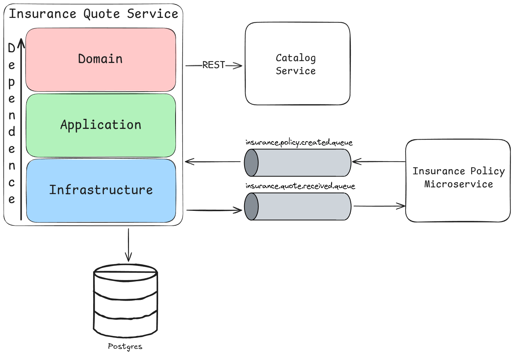
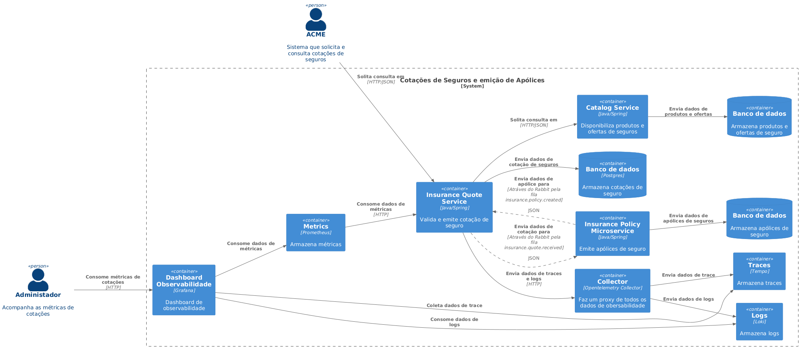

<div style="text-align: center;">
  <h1>🚀 Microserviço: Insurance Quote com Java</h1>
  <p>
    Microserviço referente ao desafio para vaga de Engenheiro de Software no Itaú<br/>
    Utilizando Clean Archicteture, DDD, TDD, Mensageria, Docker e Stack Grafana
  </p>
</div>

## Ferramentas necessárias
- JDK 17
- IDE de sua preferência
- Docker

## Como rodar o projeto
1. Clonar o repositório:
```shell
git clone https://github.com/LeandroLeiteC/insurance-quote-service.git
```

2. Subir o projeto e a infraestrutura com Docker:
```shell
docker compose up -d
```

### Parando o projeto

Para encerrar os containers, basta executar o comando:
``` shell
docker compose down
```
## Catalog Service (Mock)
O serviço Catalog está disponível via porta 8181<br>
Com os paths para product sendo `/products/{id}` e para offer `/offers/{id}`<br>
### Valores para Product e Offer
```json
{
  "product_id" : "1b2da7cc-b367-4196-8a78-9cfeec21f587", // ativo
  "product_id" : "54ea878a-ae41-4538-936b-4d8b57e66749", // inativo
  "offer_id" : "adc56d77-348c-4bf0-908f-22d402ee715c", // ativo
  "offer_id" : "760b15ce-c087-4563-a6bd-58ef46e2dada" // inativo
}
```

## Swagger
A documentação da API pode ser acessada através do Swagger, disponível em:<br/>
[Swagger](http://localhost:8080/swagger-ui/index.html)

## Mensageria
Para acessar o RabbitMQ, basta acessar o endereço (porta 15672):<br/>
[RabbitMQ](http://localhost:15672)<br/>
> User: user<br/>
> Password: 123456
### Formato das mensagens
As mensagens enviadas para a fila `insurance.quote.received.queue` seguem o formato:
```json
{
  "quote_id": 1,
  "ocurred_on: "2021-10-10T10:00:00"
}
```
As mensagens enviadas para a fila `insurance.policy.created.queue` seguem o formato:
```json
{
  "insurance_policy_id": 1,
  "quote_id": 1
}
```
## Observabilidade
Para acessar o Grafana, basta acessar o endereço (porta 3000):<br/>
[Grafana](http://localhost:3000)

## Banco de dados

O banco de dados utilizado é o PostgreSQL e o mesmo é inicializado com o Docker Compose.
>Os dados de acesso para o banco são:<br/>
>User: postgres<br/>
>Password: 123456<br/>
>Database: insurance_quote_db
> 
### Migrações do banco de dados com Flyway

Neste projeto as migrações com flyway são executados automaticamente pelo spring boot ao inicializar.
Foi criado desta forma para facilitar a execução do projeto e não precisar rodar manualmente as migrações com as tasks do gradle e flyway.


## Arquitetura


### Diagrama C4
